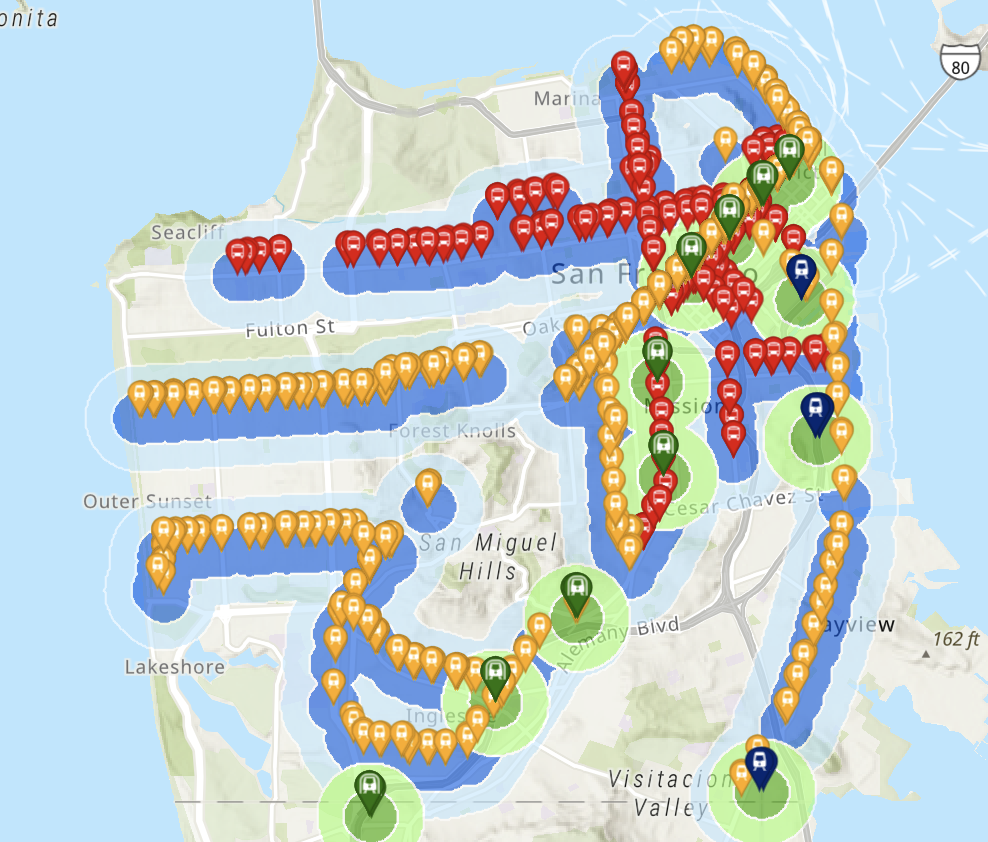

# SB79 Housing Capacity Analysis 🏠

An experimental analysis of potential housing capacity under California's SB79 transit-oriented development bill, focused on San Francisco.

## ⚠️ Disclaimer

**This project is an experiment created using AI tools (Claude/Cursor). I am not an urban planner, housing policy expert, or GIS professional.**

The analysis, methodology, and results should be treated as exploratory and educational only. They are **not** suitable for:
- Policy recommendations
- Investment decisions
- Legal or regulatory compliance
- Official planning purposes

The feasibility factors, exclusion criteria, and calculations are based on assumptions that may not reflect actual development conditions, regulatory requirements, or market realities.

**If you actually know what you're doing**, I'd love feedback! Open an issue or PR.

## What This Does

Uses publicly available GIS data from SF Planning to estimate:
- **Theoretical capacity**: Maximum units allowed under SB79 upzoning minus current baseline
- **Realistic capacity**: Theoretical capacity discounted by feasibility factors for various constraints

## Key Results

| Metric | Value |
|--------|-------|
| Theoretical Added Capacity | ~344,000 units |
| Realistic Added Capacity | ~57,000 units |
| Weighted Feasibility | ~16% |

## Visualization

### Realistic Capacity Increase by Parcel


*Heatmap showing estimated realistic housing unit increases per parcel. Most individual parcels show modest increases (<0.5 units) because feasibility discounts are applied at the parcel level based on constraints (historic status, slope, lot size, etc.). The value is in the **aggregate** (~57k total units) and **spatial distribution** — capacity concentrates near transit corridors.*

### SB79 Transit Stop Coverage



*SB79 tier boundaries are determined by distance to transit stops. Tier 1 zones (within 0.5 mi of major transit) receive the most favorable upzoning; Tier 2 zones extend further.*

**View the data yourself:** Load `sb79_sf_parcel_results.geojson` into [kepler.gl](https://kepler.gl/demo) and color by `added_units_realistic`, `feasibility_factor`, or `historic_type`.

## Data Sources

### Included in repo (via Git LFS)

| File | Size | Source |
|------|------|--------|
| `Building_Footprints_20251217.geojson` | 330MB | [SF Open Data - Building Footprints](https://data.sfgov.org/Geographic-Locations-and-Boundaries/Building-Footprints/ynuv-fyni/about_data) |
| `sb79_sf_parcel_results.geojson` | 321MB | Generated output - parcel-level results |
| `sb79_polygons.json` | 98KB | [SF Planning GIS - SB79 Tiers](https://sfplanninggis.org/arcgiswa/rest/services/PlanningData/MapServer/53) |

### Downloaded at runtime

The script downloads and caches these from SF Planning's ArcGIS REST services (`sfplanninggis.org`):
- Parcels, Zoning, Height Districts
- Historic constraint layers (7 different sources)
- Slope data
- Open space

## Files

| File | Description |
|------|-------------|
| `what_could_have_been.py` | Main analysis script |
| `SB79_Analysis_Report.md` | Detailed methodology and results |
| `sb79_sf_parcel_results.geojson` | **Parcel-level results** - load in QGIS/kepler.gl to explore |
| `Building_Footprints_20251217.geojson` | SF building footprints (input data) |
| `sb79_polygons.json` | SB79 tier boundaries (input data) |
| `cache/` | Downloaded GIS layers (gitignored) |

## Setup

```bash
pip install -r requirements.txt
python what_could_have_been.py
```

First run will download and cache GIS data from SF Planning (~5-10 min). Subsequent runs use cached data.

## Output

- **`sb79_sf_parcel_results.geojson`** - Parcel-level results (load in QGIS, kepler.gl, etc.)
- **`SB79_Analysis_Report.md`** - Detailed methodology writeup
- **`cache/`** - Downloaded GIS layers (gitignored)

## Contributing

Found a bug in my logic? Know more about SF zoning than an AI? PRs and issues welcome! (An AI wrote this).

## License

MIT license. You can do whatever you want with this, just don't expect it to be right!

