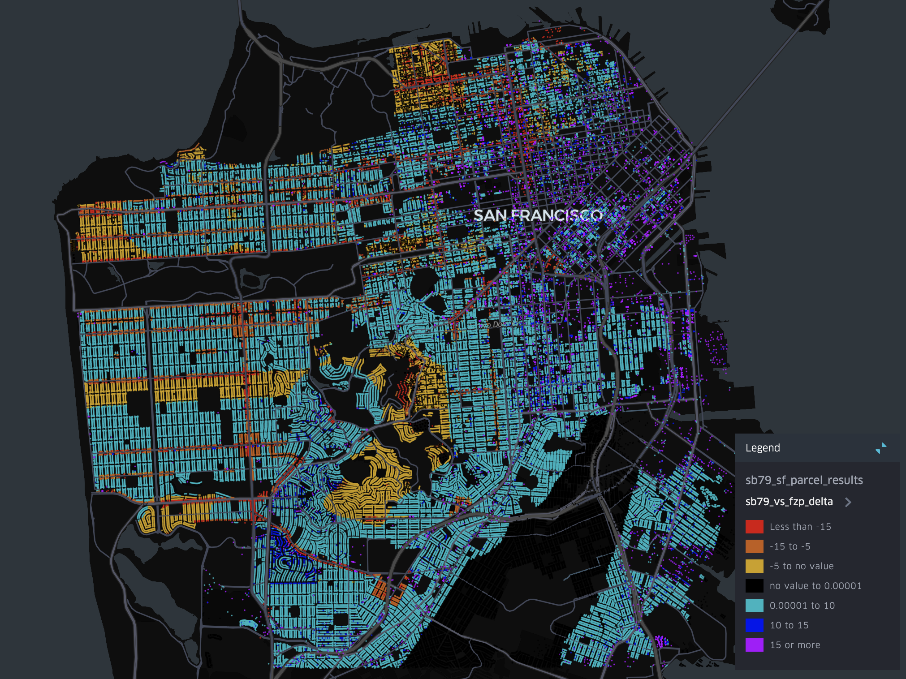

# What Could Have Been: SB79 vs San Francisco's Family Zoning Plan

**Generated:** December 18, 2025

---

## The Story

California's SB79 establishes statewide minimum zoning standards for housing near transit stops. Cities can exempt themselves from SB79 by adopting qualifying local upzoning plans before 2032.

San Francisco's response? The **Family Zoning Plan (FZP)** — a proposal that appears designed to meet the bare minimum requirements for an exemption while preserving most existing restrictions.

**This analysis compares what San Francisco could build under SB79 versus what the Family Zoning Plan would actually deliver.**

---

## Executive Summary

| Plan | Theoretical Capacity | Realistic Capacity |
|------|---------------------|-------------------|
| **SB79** | 344,235 units | **56,547 units** |
| **Family Zoning Plan** | 185,726 units | **28,756 units** |
| **Difference** | +158,509 units (+85%) | **+27,790 units (+97%)** |

**SB79 provides approximately 2x more realistic housing capacity than the Family Zoning Plan.**

- SB79 covers **143,261 parcels** vs FZP's **78,115** (+65,146 more)
- On parcels covered by **both** plans, SB79 wins on **83%** of them

### The Map Tells the Story



*Per-parcel comparison: **Blue/purple = SB79 allows more housing**, **red/orange/yellow = FZP allows more**. SB79 wins on 83% of parcels where both plans apply.*

---

## Zone Coverage Comparison

| Metric | SB79 | FZP | Difference |
|--------|------|-----|------------|
| Parcels covered | 143,261 | 78,115 | **+65,146** |

**SB79 covers 65,000+ more parcels than FZP** — entire neighborhoods are left out of the Family Zoning Plan.

---

## Why FZP Delivers Less

### 1. The Density-Limited Problem

FZP has **two density regimes** that produce dramatically different outcomes:

| FZP Density Type | Parcels | What Happens |
|------------------|---------|--------------|
| **Density-limited** | 112,146 | Keeps existing RH/RM density limits |
| **Form-based Proposed** | 9,771 | Density decontrol (no unit caps) |
| **Form-based Existing** | 4,589 | Already decontrolled |

The vast majority of FZP parcels are **"Density-limited"** — they maintain traditional density controls like:
- RH-1: 1 unit per lot
- RH-2: 1 unit per 1,500 sqft
- RH-3: 1 unit per 1,000 sqft

**Only parcels along commercial corridors (typically 65ft+ heights) get true density decontrol.**

SB79, by contrast, gives **all covered parcels** density decontrol.

### 2. Conservative Heights

| Plan | Height Distribution |
|------|-------------------|
| **FZP** | Median: 40 ft, Mean: 41 ft, Max: 400 ft |
| **SB79** | 85-105 ft across all tiers |

The FZP keeps most of San Francisco at **40-foot height limits** — unchanged from existing zoning for most residential areas.

### 3. Narrower Geography

The FZP only covers ~78,000 parcels compared to SB79's ~143,000. Large swaths of transit-accessible San Francisco get no upzoning at all under FZP.

---

## How We Calculate FZP Capacity

Understanding FZP's density rules is critical to accurate modeling. Per SF Planning documentation:

> *"Other residential districts generally retain existing density limits, unless they use [the optional] Local Program."*

### Our Approach

```
For each FZP parcel:

IF density_type = "Form-based Existing" or "Form-based Proposed":
    → Density decontrol (500 du/acre — effectively unlimited)
    → FAR derived from height is the binding constraint

ELSE (Density-limited):
    → Look up CurrentZoning (RH-1, RH-2, RM-1, etc.)
    → Use that zone's EXISTING density limits
    → FAR derived from FZP height

Height source: NEW_HEIGHT_NUM (proposed FZP height)
FAR calculation: (height / 10ft per floor) × 0.8 coverage factor
```

### Why This Matters

A 2,500 sqft lot in an RH-1 zone under each plan:

| Plan | Height | Density Rule | Result |
|------|--------|--------------|--------|
| **SB79 T2Z1** | 85 ft | Decontrolled | ~8 units |
| **FZP (Density-limited)** | 40 ft | 1 unit/lot (RH-1) | ~1 unit |
| **FZP (Form-based)** | 65 ft | Decontrolled | ~5 units |

The **density-limited** designation dramatically reduces FZP's impact on most residential parcels.

---

## Head-to-Head: Parcels in Both Zones

For the 61,435 parcels covered by **both** plans:

| Comparison | Parcels | Percentage |
|------------|---------|------------|
| SB79 allows more | 51,215 | **83%** |
| FZP allows more | 10,187 | 17% |
| Essentially equal | 33 | <1% |

**On 83% of overlapping parcels, SB79 would allow more housing than FZP.**

### Where SB79 Wins Biggest

| Zone | SB79 Tier | SB79 Units | FZP Units | FZP Height | Δ |
|------|-----------|-----------|-----------|------------|---|
| P | T1Z1 | 91.9 | 22.2 | 50 ft | +69.7 |
| P | T1Z1 | 88.7 | 21.4 | 70 ft | +67.3 |
| RH-1 | T2Z1 | 95.5 | 28.6 | 40 ft | +66.8 |
| RTO | T1Z2 | 91.1 | 26.4 | 40 ft | +64.7 |
| RTO | T2Z1 | 85.0 | 24.7 | 40 ft | +60.4 |

The biggest differences are in residential zones where FZP maintains low heights and density limits.

### Where FZP Wins

| Zone | SB79 Tier | SB79 Units | FZP Units | FZP Height | Δ |
|------|-----------|-----------|-----------|------------|---|
| P | T1Z2 | 99.5 | 497.7 | 100 ft | -398.2 |
| RC-4 | T2Z1 | 88.2 | 440.9 | 140 ft | -352.7 |
| RC-4 | T2Z1 | 84.9 | 424.3 | 140 ft | -339.5 |
| RC-4 | T2Z1 | 82.9 | 414.7 | 260 ft | -331.8 |
| RH-1(D) | T2Z1 | 82.5 | 412.5 | 70 ft | -330.0 |

FZP exceeds SB79 in commercial/mixed-use zones where FZP proposes significant height increases (100-260ft) with form-based zoning. These are already higher-density areas, typically near downtown or on major corridors.

---

## Capacity by Constraint Type

### Historic Constraints

| Type | Theoretical Capacity | Realistic Capacity | Feasibility |
|------|---------------------|-------------------|-------------|
| Landmark | 11,036 units | 221 units | 2% |
| Individual Historic | 64,425 units | 6,443 units | 10% |
| Historic District | 9,858 units | 1,479 units | 15% |
| Surveyed | 3,806 units | 685 units | 18% |
| **Total Historic** | **89,126 units** | **8,827 units** | ~10% avg |

### Slope Constraints

| Type | Theoretical Capacity | Realistic Capacity | Feasibility |
|------|---------------------|-------------------|-------------|
| Steep (>25%) | 119,352 units | 18,924 units | 12% |
| Moderate (20-25%) | 156,835 units | 25,383 units | 18% |

*Note: Slope discounts only apply to undeveloped parcels. If a parcel already has buildings, the slope is demonstrably buildable.*

---

## Methodology

### Data Sources

All geospatial data from [SF Planning's ArcGIS REST services](https://sfplanninggis.org/arcgiswa/rest/services/PlanningData/MapServer):

| Data | Source |
|------|--------|
| Parcels | SF Planning MapServer/23 |
| Zoning | SF Planning MapServer/3 |
| Height Districts | SF Planning MapServer/5 |
| Historic Layers | MapServer 0, 6, 7, 11, 16, 17, 30 |
| Slopes | MapServer 18, 19 |
| Open Space | MapServer 20 |
| SB79 Tiers | USC Spatial Sciences Institute |
| FZP Density & Heights | [SF Rezoning Experience](https://sfgov.maps.arcgis.com) (November 2025 ordinance) |

### Capacity Calculation

For both plans, we calculate:

```
units = min(
    parcel_area × density,
    parcel_area × FAR × efficiency / avg_unit_size
)
```

Where:
- `efficiency` = 85% (gross-to-net)
- `avg_unit_size` = 800 sqft

### FZP-Specific Calculation

```python
if density_type in ("Form-based Existing", "Form-based Proposed"):
    # Density decontrol — FAR is the binding constraint
    fzp_density = 500  # Effectively unlimited
else:
    # Density-limited — use existing zoning's density limits
    fzp_density = BASELINE_ZONING[current_zone]["du_ac"]

fzp_height = NEW_HEIGHT_NUM  # Proposed FZP height
fzp_far = (fzp_height / 10) × 0.8

units = min(parcel_area × fzp_density, parcel_area × fzp_far × 0.85 / 800)
```

### Feasibility Factors

| Constraint | Feasibility Rate | Rationale |
|------------|-----------------|-----------|
| Landmarks | 2% | Extremely rare redevelopment |
| Individual Historic | 10% | CEQA review, preservation concerns |
| Historic District | 15% | Design review friction |
| Surveyed Historic | 18% | Evaluation required |
| Steep Slope (>25%) | 12% | Engineering challenges (undeveloped only) |
| Moderate Slope (20-25%) | 18% | Minor construction impact (undeveloped only) |
| Small Lots (<2,500 sqft) | 15% | Hard to pencil financially |
| Tier 1 SB79 | 25% | Most favorable conditions |
| Default | 20% | Typical development barriers |

*Note: Constraints are applied hierarchically — the most restrictive matching constraint determines the feasibility factor.*

### Exclusions

Parcels entirely excluded:
- Open space (parks, public land)
- Parcels >1 acre (likely institutional)
- Highly utilized parcels (>80% of upzoned FAR already built)

---

## Key Takeaways

1. **SB79 provides roughly 2x the housing capacity of FZP** — both in theoretical and realistic terms.

2. **The density-limited problem**: 112,000+ FZP parcels keep their existing density limits (1 unit/lot, etc.), while SB79 decontrols density on all covered parcels.

3. **FZP maintains the status quo for most neighborhoods**: With median heights of 40ft and most parcels density-limited, FZP barely moves the needle outside commercial corridors.

4. **SB79 covers more ground**: 65,000+ more parcels fall within SB79 zones than FZP.

5. **The exemption deadline matters**: If SF adopts FZP before 2032, it gets to keep these restrictions. After 2032, SB79 applies statewide regardless.

---

## What This Means

By adopting the Family Zoning Plan instead of allowing SB79 to take effect, San Francisco is choosing to:

- Build **~28,000 fewer housing units** over the next 20 years (56,547 vs 28,756)
- Keep heights at 40ft and density limits intact across most residential neighborhoods
- Leave 65,146 transit-accessible parcels with no upzoning
- Grant true density decontrol only to ~14,360 parcels on commercial corridors

The question for San Franciscans: **Is that trade-off worth it?**

---

*Analysis performed using Python with GeoPandas. Full methodology and code available in this repository.*
